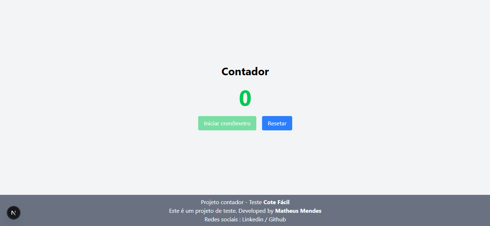

# Timer App ⏱️

Aplicação simples de cronômetro e timer regressivo desenvolvida em **Next.js** com **React** e **TailwindCSS**.

---

## 🚀 Como executar o projeto

1. Clonar o repositório:
   git clone https://github.com/matheusmndspp/cotefacil-teste
   cd cotefacil-teste

2. Instalar dependências:
   npm install

   # ou

   yarn install

3. Rodar em ambiente de desenvolvimento:
   npm run dev

   # ou

   yarn dev

   A aplicação estará disponível em: http://localhost:3000

4. Build para produção:
   npm run build
   npm start

---

## 🛠️ Descrição técnica

- Framework: Next.js
- Biblioteca UI: React
- Estilização: TailwindCSS

### Funcionalidades principais

- Contador: usuário adiciona tempo manualmente clicando no número.
- Modo timer regressivo: conta para baixo até 00:00 e retorna automaticamente ao contador.
- Modo cronômetro: conta para cima a partir do tempo inicial.

---

## 👨‍💻 Autor

Projeto desenvolvido por **Matheus Mendes**

- LinkedIn: https://www.linkedin.com/in/matheusmendespp/
- GitHub: https://github.com/matheusmndspp
